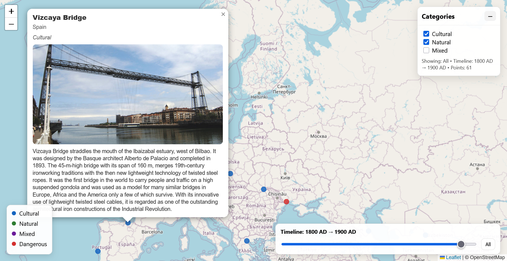

# UNESCO Heritage Map

Interactive Leaflet map of UNESCO World Heritage Sites with category filters and a timeline based on estimated construction and origin dates.



## Overview

This repository has two main parts:

- A frontend in `index/` that reads `convert/sites.geojson`
- A data workflow in `convert/` for extracting, reviewing, and finalizing construction dates

The workflow is:

```text
Run Gemini/GPT extraction -> compare disagreements -> label disagreements manually -> apply human-selected dates to sites.geojson -> display final dates in the Leaflet map
```

Prompting comes first, and human labels are the final source of truth written back into the GeoJSON used by the map.

## Key Features

- Interactive Leaflet map of UNESCO World Heritage Sites
- Category filters and timeline controls
- Parallel date extraction workflow for Gemini and GPT
- Human review step for disagreements between model outputs
- Finalization step that writes human-selected normalized dates back into `convert/sites.geojson`
- Resumable extraction caches written atomically after each row

## Technologies Used

- Frontend: Leaflet, static HTML/JS served locally
- Data processing: Python
- Dependency: `pandas`
- Models:
  - Gemini extraction: `gemini-2.5-flash-lite`
  - OpenAI extraction: `gpt-4o-mini`
  - Evaluation metadata: `gpt-4.1`

## Installation

Install the Python dependency:

```bash
python3 -m pip install pandas
```

Or use the repository dependency file:

```bash
python3 -m pip install -r requirements.txt
```

## Configuration

Create `.env` from `.env.example`:

```bash
cp .env.example .env
```

Important variables:

| Variable | Purpose |
| --- | --- |
| `GEMINI_API_KEY` | Required for `--gemini` or `--both` |
| `OPENAI_API_KEY` | Required for `--gpt` or `--both` |
| `GEMINI_MODEL` | Gemini extraction model |
| `OPENAI_MODEL` | OpenAI extraction model |
| `EVAL_MODEL` | Stronger evaluation model metadata |
| `GEOJSON_INPUT` | Input GeoJSON, usually `convert/sites.geojson` |
| `GEOJSON_OUTPUT` | Output GeoJSON, usually `convert/sites.geojson` |
| `GEMINI_CACHE_PATH` | Gemini cache path |
| `GPT_CACHE_PATH` | GPT cache path |
| `LLM_BATCH_LIMIT` | Optional number of new API rows to process |
| `LLM_REQUEST_DELAY_SECONDS` | Delay between API calls |
| `FORCE_LLM` | Set `1` to ignore cache and call APIs again |

Optional cost estimate variables:

```env
GEMINI_INPUT_COST_PER_1M=
GEMINI_OUTPUT_COST_PER_1M=
GPT_INPUT_COST_PER_1M=
GPT_OUTPUT_COST_PER_1M=
```

If prices are blank, `cost_estimate` is `null`.

## Usage

### Main Workflow

| Step | Script | Output |
| --- | --- | --- |
| 1. LLM extraction | `convert/extract_construction_history.py` | `convert/llm_cache_gemini.json`, `convert/llm_cache_gpt.json`, updated `convert/sites.geojson` |
| 2. Human label prep | `convert/human_label_disagreements.py` | `convert/llm_disagreements.json`, `convert/disagreements.csv` |
| 3. Evaluation and finalization | `convert/evaluate_construction_dates.py` | `convert/eval_score.json`, updated `convert/sites.geojson` |

Run both extraction models:

```bash
python3 convert/extract_construction_history.py --both
```

Create the human-label CSV:

```bash
python3 convert/human_label_disagreements.py
```

Edit:

```text
convert/disagreements.csv
```

Fill `human_choice` with one of:

```text
gemini
gpt
tie
neither
```

For manual corrections when `human_choice` is `neither`, fill:

```text
correct_start, correct_end, correct_BC_AD
```

Optional:

```text
correct_display
```

Then score labels and apply the final human-selected dates to the GeoJSON:

```bash
python3 convert/evaluate_construction_dates.py --score --apply-final-dates
```

Final useful outputs:

```text
convert/eval_score.json
convert/sites.geojson
```

### Extraction

Gemini only:

```bash
python3 convert/extract_construction_history.py --gemini
```

GPT only:

```bash
python3 convert/extract_construction_history.py --gpt
```

Both:

```bash
python3 convert/extract_construction_history.py --both
```

Small test batch:

```bash
LLM_BATCH_LIMIT=10 python3 convert/extract_construction_history.py --both
```

Force re-run API calls even when cache exists:

```bash
python3 convert/extract_construction_history.py --both --force
```

Local parser only, with no API calls:

```bash
NO_LLM=1 python3 convert/extract_construction_history.py --no-llm
```

Cache behavior:

- Cached successful rows are reused automatically
- `pandas` builds the filter table before API calls
- Duplicate rows are handled manually by cache key before API calls
- `heritage_category=Natural` rows are handled manually without LLM calls and cached as `date: null`
- `LLM_BATCH_LIMIT` sets the maximum number of new API rows to process
- If `LLM_BATCH_LIMIT` is larger than the filtered row count, only the filtered row count is sent
- If every row is already cached, extraction makes no API calls
- Use `--force` or `FORCE_LLM=1` to ignore cache and call APIs again

### Human Labeling

Prepare disagreements:

```bash
python3 convert/human_label_disagreements.py
```

A row is included when:

- `llm_built` differs
- Normalized `date` differs
- One model has `date: null` and the other does not

This step writes:

```text
convert/llm_disagreements.json
convert/disagreements.csv
```

Re-running the script preserves existing label columns, so AI output does not overwrite human labels. This step uses `pandas`, compares cache rows, and writes the CSV without calling any model.

### Finalization

Apply final dates to the GeoJSON:

```bash
python3 convert/evaluate_construction_dates.py --apply-final-dates
```

Score labels only:

```bash
python3 convert/evaluate_construction_dates.py --score
```

Do both:

```bash
python3 convert/evaluate_construction_dates.py --score --apply-final-dates
```

`--score` reads `convert/disagreements.csv` and writes:

```text
convert/eval_score.json
```

`--apply-final-dates` reads labeled rows from `convert/disagreements.csv` and writes the selected final normalized dates back to:

```text
convert/sites.geojson
```

Selection rules:

- `gemini` uses the Gemini normalized date
- `gpt` uses the GPT normalized date
- `tie` uses the first available normalized date from Gemini or GPT
- `neither` uses `correct_start`, `correct_end`, and `correct_BC_AD`

For manual corrections, `correct_display` is optional. If it is blank, the display string is generated automatically to match the GeoJSON format, including BC timeline normalization with negative values.

Unlabeled rows are skipped safely. The script reports:

- Gemini selections
- GPT selections
- Ties
- Manual corrections
- Skipped rows
- Updated GeoJSON features

### Frontend

Start a local server from the project root:

```bash
python3 -m http.server 8000
```

Open:

```text
http://localhost:8000/index/
```

## Limitations or Known Issues

- Natural heritage sites are not sent to extraction models and are cached as `date: null`
- `A long time ago` is only used for explicit million-year cases
- Malformed LLM dates are validated and may fall back to the local parser

## Future Improvements

- Improve the disagreement review and finalization workflow for edge cases with missing or conflicting extracted dates

